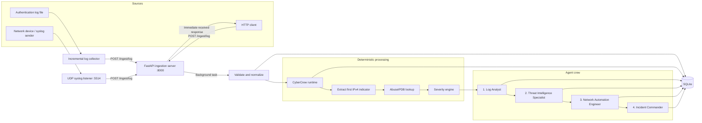
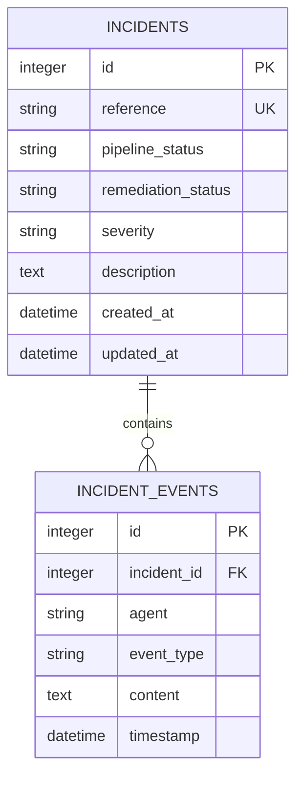

# CyberCrew

**An AI-assisted incident triage pipeline for SSH and Linux authentication logs.**

CyberCrew collects authentication events, enriches suspicious IP addresses with threat intelligence, assigns a deterministic severity score, coordinates four specialized CrewAI agents, and preserves the resulting investigation as an incident timeline in SQLite.

The project is designed as a practical SOC automation laboratory: deterministic code handles ingestion, parsing, enrichment, scoring, and storage, while an LLM turns that evidence into analysis, mitigation guidance, and a readable incident report.

> [!WARNING]
> CyberCrew is a proof of concept. It is not a SIEM, IDS, or autonomous response platform. Generated firewall commands are recommendations and are never executed by the application. Validate all AI output before using it in a real environment.

## Table of contents

- [Why CyberCrew?](#why-cybercrew)
- [Capabilities](#capabilities)
- [How it works](#how-it-works)
- [Agents](#agents)
- [Processing flows](#processing-flows)
- [Project structure](#project-structure)
- [Quick start](#quick-start)
- [Configuration](#configuration)
- [Running CyberCrew](#running-cybercrew)
- [API reference](#api-reference)
- [Incident data](#incident-data)
- [Detection and severity logic](#detection-and-severity-logic)
- [Threat intelligence](#threat-intelligence)
- [Docker](#docker)
- [Troubleshooting](#troubleshooting)
- [Security and privacy](#security-and-privacy)
- [Known limitations](#known-limitations)
- [Roadmap](#roadmap)
- [Contributing](#contributing)

## Why CyberCrew?

A conventional log pipeline can match patterns and raise an alert, but an analyst still has to correlate the event, assess risk, propose containment, and write a report. CyberCrew experiments with dividing those responsibilities across focused AI agents while keeping the core security decisions visible and reproducible.

The current implementation answers a narrow question end to end:

> What should a SOC analyst know and consider doing after receiving a suspicious SSH authentication event?

It is useful for:

- learning how agentic AI can fit into a defensive-security workflow;
- prototyping automated SOC triage and reporting;
- testing OpenAI and local Ollama models through the same pipeline;
- demonstrating syslog-to-incident processing;
- experimenting with deterministic guardrails around LLM-generated analysis.

It is not intended for unattended blocking, high-volume production ingestion, or handling sensitive telemetry without additional controls.

## Capabilities

| Area | Current capability |
|---|---|
| Collection | Incremental file tailing with a persisted byte offset |
| Syslog | Threaded UDP listener on configurable host and port |
| Ingestion | FastAPI endpoint with immediate acknowledgement and background analysis |
| Validation | Basic SSH/authentication keyword validation |
| Parsing | Failed-password username, timestamp, and IPv4 extraction |
| Threat intelligence | AbuseIPDB lookup with a 90-day reporting window |
| Severity | Deterministic score based on threat reputation and log content |
| AI analysis | Four sequential CrewAI agents with task context handoff |
| Mitigation | Suggested `iptables` block, rate-limit, or monitoring action |
| Persistence | SQLite incidents and chronological event records via SQLAlchemy |
| Models | OpenAI-compatible CrewAI model or local Ollama model |
| Reporting | Markdown incident summary produced by the Incident Commander |

## How it works



For every accepted log, the runtime:

1. extracts the first token that resembles an IPv4 address;
2. queries AbuseIPDB when an API key is available;
3. calculates a severity score from explicit rules;
4. creates an incident record;
5. runs the four CrewAI tasks in sequence;
6. records each agent callback as an incident event;
7. marks the analysis incident as completed after the final report.

This hybrid design matters: the LLM can explain and contextualize the evidence, but the initial reputation mapping and severity score do not depend on an LLM response.

## Agents

### 1. Log Analyst

Parses OpenSSH failed-password entries and extracts structured indicators:

```json
[
  {
    "date": "Nov 22 10:15:31",
    "user": "admin",
    "ip": "203.0.113.10"
  }
]
```

The parser currently recognizes messages containing `Failed password for <user> from <IPv4>`.

### 2. Threat Intelligence Specialist

Enriches extracted addresses through the `lookup_threat` tool. The tool converts the AbuseIPDB confidence score to a simple reputation:

- `high` when the confidence score is greater than 75;
- `medium` when it is greater than 25;
- `low` otherwise;
- `unknown` when the key is missing, the provider fails, or the response cannot be parsed.

### 3. Network Automation Engineer

Converts each address and reputation into a proposed response:

| Reputation | Proposed action | Example |
|---|---|---|
| High | Block | `iptables -A INPUT -s 203.0.113.10 -j DROP` |
| Medium | Rate-limit | `iptables -A INPUT -s 203.0.113.10 -m limit --limit 10/minute -j ACCEPT` |
| Low / safe | Monitor | Comment only; no blocking rule |
| Unknown | No automatic action | Comment explaining unrecognized severity |

These commands are report content only. CyberCrew does not invoke `iptables`.

### 4. Incident Commander

Uses the preceding task context to create a Markdown report containing:

1. incident summary;
2. suspicious IP addresses;
3. threat-intelligence findings;
4. network mitigations;
5. executive summary.

## Processing flows

CyberCrew currently has three entry paths.

### Direct file analysis

`main.py` analyzes `data/sample_logs/auth.log` as a batch. It creates one incident and asks the crew to identify suspicious addresses across the file.

```text
auth.log -> main.py -> CrewAI tasks -> incidents.db + terminal report
```

### HTTP or syslog ingestion

The FastAPI server accepts one event, returns immediately, and schedules processing in the application process.

```text
sender -> POST /ingest/log -> {"status":"received"}
                              |
                              +-> background analysis -> incidents.db
```

The UDP listener is a transport adapter. It receives a datagram, adds source metadata, and forwards the event to the same HTTP endpoint.

### Incremental file collection

`LogCollector` repeatedly opens a file, seeks to a saved byte offset, and posts new non-empty lines to the API. Its offset file allows collection to resume after a restart.

## Project structure

```text
CyberCrew/
├── agents/
│   ├── incident_commander.py   Final Markdown report agent
│   ├── log_analyst.py          SSH parsing agent and CrewAI tool
│   ├── network_engineer.py     Mitigation agent and CrewAI tool
│   └── threat_intel.py         Reputation-enrichment agent and tool
├── collector/
│   ├── log_collector.py        Polling file-tail collector
│   ├── run_collector.py        Example collector launcher
│   └── syslog_listener.py      Threaded UDP-to-HTTP bridge
├── incident_storage/
│   ├── database.py             SQLite engine and session factory
│   ├── incident_manager.py     Incident/event persistence operations
│   └── models.py               SQLAlchemy data model
├── ingestion/
│   ├── server.py               FastAPI application and background workflow
│   ├── storage.py              Optional raw-log file storage helper
│   └── validator.py            Basic input validation
├── tools/
│   ├── log_tools.py            Regex-based SSH log parser
│   ├── network_tools.py        Deterministic mitigation suggestions
│   ├── severity_engine.py      Deterministic severity scorer
│   └── threat_tools.py         AbuseIPDB client
├── cybercrew_runtime.py        Single-event CrewAI runtime
├── main.py                     Batch/file runtime
├── Dockerfile                  Python 3.11 container definition
├── requirements.txt            Primary pinned dependencies
├── requirements.lock.txt       Older alternate environment snapshot
└── To-Do-List                  Detailed development backlog
```

## Quick start

### Prerequisites

- Python 3.11
- `pip` and `venv`
- either an OpenAI API key or a locally running Ollama service
- an AbuseIPDB API key if live reputation enrichment is required

### 1. Clone and install

```bash
git clone https://github.com/gitbenjazz/CyberCrew.git
cd CyberCrew
python3.11 -m venv .venv
source .venv/bin/activate
python -m pip install --upgrade pip
python -m pip install -r requirements.txt
```

On Windows PowerShell, activate the environment with:

```powershell
.venv\Scripts\Activate.ps1
```

### 2. Configure a model

Create `.env` in the repository root.

OpenAI example:

```dotenv
LLM_PROVIDER=openai
CREWAI_MODEL=gpt-4o-mini
OPENAI_API_KEY=replace_with_your_key
ABUSEIPDB_API_KEY=replace_with_your_key
PIPELINE_TEMPERATURE=0.2
```

Ollama example:

```dotenv
LLM_PROVIDER=ollama
CREWAI_MODEL=llama3.2
ABUSEIPDB_API_KEY=replace_with_your_key
PIPELINE_TEMPERATURE=0.2
```

Start Ollama separately and ensure the selected model is installed:

```bash
ollama pull llama3.2
ollama serve
```

### 3. Create a sample log

```bash
mkdir -p data/sample_logs
printf '%s\n' 'Nov 22 10:15:31 server sshd[1234]: Failed password for admin from 203.0.113.10 port 52144 ssh2' \
  > data/sample_logs/auth.log
```

### 4. Run the file pipeline

```bash
python main.py
```

CrewAI prints verbose task execution followed by the final report. Incident data is saved in `incident_storage/incidents.db`.

## Configuration

### Model and pipeline variables

| Variable | Required | Default | Description |
|---|:---:|---|---|
| `LLM_PROVIDER` | No | `openai` | Use `openai` or `ollama` |
| `CREWAI_MODEL` | No | `gpt-4o-mini` | Model name passed to CrewAI |
| `OPENAI_API_KEY` | OpenAI only | — | Credential for the OpenAI provider |
| `ABUSEIPDB_API_KEY` | No | — | Enables live threat enrichment |
| `PIPELINE_TEMPERATURE` | No | `0.2` | File-pipeline temperature; invalid values fall back to `0.2` |
| `ENV` | No | `dev` | Accepted values are `dev` and `prod`; both currently load `.env` |

### Syslog listener variables

| Variable | Required | Default | Description |
|---|:---:|---|---|
| `SYSLOG_HOST` | No | `0.0.0.0` | UDP bind address |
| `SYSLOG_PORT` | No | `5514` | UDP port; 5514 avoids privileged-port requirements |
| `INGESTION_URL` | No | `http://127.0.0.1:8000/ingest/log` | HTTP endpoint receiving forwarded events |
| `SYSLOG_INGEST_TIMEOUT` | No | `3.0` | HTTP forwarding timeout in seconds |

The example file collector currently configures its file path, endpoint, and polling interval directly in `collector/run_collector.py`, not through environment variables.

## Running CyberCrew

### Option A: Analyze the default file

```bash
python main.py
```

Use this option for a simple demonstration or for analyzing several supported SSH lines from one file.

### Option B: Start the ingestion API

```bash
uvicorn ingestion.server:app --host 0.0.0.0 --port 8000
```

Useful URLs:

- health check: <http://127.0.0.1:8000/health>
- Swagger UI: <http://127.0.0.1:8000/docs>
- OpenAPI schema: <http://127.0.0.1:8000/openapi.json>

Submit an event:

```bash
curl -X POST http://127.0.0.1:8000/ingest/log \
  -H 'Content-Type: application/json' \
  -d '{
    "log": "Nov 22 10:15:31 server sshd[1234]: Failed password for admin from 203.0.113.10 port 52144 ssh2",
    "source_ip": "127.0.0.1",
    "source_port": 5514,
    "transport": "manual"
  }'
```

Expected acknowledgement:

```json
{
  "status": "received"
}
```

This response means the event was accepted for background processing, not that analysis has finished.

### Option C: Add the UDP syslog listener

Start the API first, then run this in another terminal:

```bash
python -m collector.syslog_listener
```

Send a test datagram:

```bash
printf '%s' '<34>Nov 22 10:15:31 server sshd[1234]: Failed password for admin from 203.0.113.10 port 52144 ssh2' \
  | nc -u -w1 127.0.0.1 5514
```

The listener logs the sender address and reports whether the API returned HTTP 200.

### Option D: Tail a local file

The included launcher watches `test_auth.log`:

```bash
touch test_auth.log
python -m collector.run_collector
```

In a second terminal:

```bash
printf '%s\n' 'Nov 22 10:15:31 server sshd[1234]: Failed password for admin from 203.0.113.10 port 52144 ssh2' \
  >> test_auth.log
```

The collector polls every two seconds and persists its position in `collector/.authlog.offset`.

## API reference

### `GET /health`

Reports whether the web process is available.

```json
{"status": "ok"}
```

This endpoint does not verify LLM credentials, AbuseIPDB connectivity, database write access, or background-worker health.

### `POST /ingest/log`

Accepts a single log entry.

| Field | Type | Required | Meaning |
|---|---|:---:|---|
| `log` | string | Yes | Raw authentication or SSH log message |
| `source_ip` | string or null | No | Sender recorded by the transport adapter |
| `source_port` | integer or null | No | Sender port |
| `transport` | string or null | No | Origin label such as `udp_syslog` or `manual` |

The background validator rejects empty/very short messages and messages that contain none of these case-insensitive keywords: `failed`, `accepted`, `invalid`, or `sshd`. Because validation happens after acknowledgement, an invalid event can still receive `{"status":"received"}` and then be discarded.

## Incident data

The database is created automatically at:

```text
incident_storage/incidents.db
```

### Data model



Pipeline status begins as `running` and is set to `completed` by the final callback. Remediation status begins as `open`. Typical event types include `log_received`, `log_analysis`, `threat_intel`, `mitigation`, `final_report`, and `analysis_result`.

Inspect recent incidents with the SQLite CLI:

```bash
sqlite3 -header -column incident_storage/incidents.db \
  'SELECT id, reference, severity, pipeline_status, remediation_status, created_at FROM incidents ORDER BY created_at DESC LIMIT 10;'
```

Inspect an incident timeline:

```bash
sqlite3 -header -column incident_storage/incidents.db \
  'SELECT timestamp, agent, event_type, content FROM incident_events WHERE incident_id = 1 ORDER BY timestamp;'
```

The database may contain real log content and model output. Treat it as sensitive operational data and do not commit it.

## Detection and severity logic

### Supported batch-parser pattern

The deterministic parser is intentionally narrow. It expects a line resembling:

```text
Nov 22 10:15:31 host sshd[1234]: Failed password for admin from 203.0.113.10 port 52144 ssh2
```

The current username expression accepts word characters only, and the address expression accepts dotted decimal text. IPv6 and many OpenSSH variants are not yet supported.

### Score contributions

| Signal | Points |
|---|---:|
| AbuseIPDB reputation is high | +50 |
| AbuseIPDB reputation is medium | +25 |
| Provider details mention hosting, data center, or transit | +10 |
| Log contains `failed password` | +20 |
| Log contains `invalid user` | +15 |
| Log contains both `pam_unix` and `authentication failure` | +15 |
| Log contains `sudo` and a failure indicator | +30 |

Signals are cumulative. The mapping is:

| Total score | Severity |
|---:|---|
| 70 or higher | Critical |
| 40–69 | High |
| 20–39 | Medium |
| Below 20 | Low |

Example: a failed-password event from an IP with high reputation risk scores at least 70 points and is classified as critical.

## Threat intelligence

CyberCrew calls AbuseIPDB's IP check endpoint with `maxAgeInDays=90`. Only the first IPv4-like token extracted by `cybercrew_runtime.py` is looked up before the single-event agent pipeline.

If the API key is absent, the runtime continues with:

```json
{
  "ip": "203.0.113.10",
  "reputation": "unknown",
  "source": "missing API key"
}
```

Provider failures are converted to `unknown` responses rather than raised to the caller. This keeps the analysis running but means unavailable enrichment can reduce the calculated severity.

## Docker

Build the image:

```bash
docker build -t cybercrew .
```

The current image starts `python main.py`, so it runs the file-analysis path rather than the FastAPI service. Supply the input directory and persist the incident database:

```bash
docker run --rm \
  --env-file .env \
  -v "$PWD/data:/app/data:ro" \
  -v "$PWD/incident_storage:/app/incident_storage" \
  cybercrew
```

To run the ingestion server from the same image, override the command:

```bash
docker run --rm \
  --env-file .env \
  -p 8000:8000 \
  -v "$PWD/incident_storage:/app/incident_storage" \
  cybercrew \
  uvicorn ingestion.server:app --host 0.0.0.0 --port 8000
```

Ollama networking from inside a container depends on the host platform. `localhost` inside the container refers to the container itself, not necessarily the host running Ollama.

## Troubleshooting

### `OPENAI_API_KEY missing!` or `Missing OPENAI_API_KEY`

Ensure `.env` exists in the repository root, `LLM_PROVIDER=openai`, and the key is present. `main.py` loads `.env` explicitly; other entry points depend on the process environment and imports that load it.

### Ollama model cannot be reached

Confirm Ollama is running and the configured model exists:

```bash
ollama list
ollama serve
```

Use the plain model name in `CREWAI_MODEL`; the runtime adds the `ollama/` prefix for CrewAI.

### `File not found: data/sample_logs/auth.log`

Create the directory and file described in [Quick start](#quick-start), or call `run_pipeline()` from Python with another path.

### Ingestion returns success but no incident completes

`POST /ingest/log` only acknowledges scheduling. Check the Uvicorn terminal for validation, model, provider, or database errors. Background exceptions do not change the already-returned HTTP response.

### Syslog forwarding times out

Verify the API is listening, `INGESTION_URL` is correct, and `/health` responds. The listener's default forwarding timeout is three seconds.

### AbuseIPDB always returns `unknown`

Check `ABUSEIPDB_API_KEY`, network access, API quota, and the listener/API process environment. The tool logs provider failures as structured fallback data.

### Duplicate incidents appear

This is a known behavior of the ingestion path: `process_log_background()` creates an ingestion incident and `analyze_log()` creates a second analysis incident. See [Known limitations](#known-limitations).

## Security and privacy

Logs commonly contain usernames, hostnames, internal IP addresses, public IP addresses, and details about authentication failures. In the OpenAI configuration, relevant task content is sent to the configured model provider. Public IP indicators are sent to AbuseIPDB when its key is configured.

Before using production data:

- confirm organizational approval and provider retention policies;
- redact secrets and unnecessary personal data;
- protect `.env` and `incident_storage/incidents.db`;
- bind the API and syslog listener only to intended interfaces;
- place authentication, TLS, rate limiting, and network controls in front of the API;
- use an approved local model when telemetry must remain on-premises;
- review suggested mitigations for false positives and self-lockout risk.

The ingestion API has no authentication. Binding it to `0.0.0.0` exposes it to reachable networks unless a firewall or reverse proxy restricts access.

## Known limitations

| Area | Limitation | Operational effect |
|---|---|---|
| Incident lifecycle | Ingestion creates one incident and the runtime creates another | A single event can produce duplicate/related records |
| Background execution | Uses in-process FastAPI background tasks | Work is lost if the process exits; no durable retry or queue |
| API security | No authentication, authorization, TLS, or rate limiting | The endpoint is unsafe to expose directly |
| Syslog | UDP only; no TCP, TLS, or full RFC 3164/5424 parser | Delivery is unreliable and metadata parsing is incomplete |
| Parsing | Narrow SSH regex, simple first-IP extraction, no IPv6 | Valid events may be missed or incorrectly extracted |
| Collector | No rotation/truncation handling; offset advances after a partially failed batch | Lines can be skipped in some failure scenarios |
| References | Direct runtimes use second-resolution timestamps | Concurrent incidents may collide on the unique reference |
| Status handling | Most exceptions do not mark incidents as `failed` | Records can remain in `running` state |
| Severity storage | Ingestion passes the full severity dictionary to `update_severity()` | The stored value may not match the intended scalar severity |
| Model output | Agent JSON/Markdown expectations are not schema-enforced | Downstream output can vary by model |
| Testing | No automated test suite or CI workflow | Regressions are not detected automatically |
| Packaging | Two dependency snapshots contain different package versions | Environments may behave differently depending on the selected file |

## Roadmap

The next useful engineering steps are:

1. unify ingestion and analysis around a single incident ID;
2. add typed schemas for indicators, intelligence, mitigations, and reports;
3. replace in-process background tasks with a durable queue and worker;
4. implement RFC-aware TCP/TLS syslog ingestion;
5. add robust IPv4/IPv6 parsing and log-rotation handling;
6. introduce API authentication, source validation, and rate limiting;
7. add unit, integration, and end-to-end tests in CI;
8. add incident querying, reporting, and a dashboard;
9. map findings to MITRE ATT&CK and support additional intelligence sources;
10. introduce human approval before any response automation.

See [`To-Do-List`](To-Do-List) for the broader project backlog.

## Development checks

There is not yet a formal test suite. A minimal source validation can be run with:

```bash
python -m compileall -q agents collector incident_storage ingestion tools main.py cybercrew_runtime.py
```

When adding tests, the highest-priority targets are the validator, log parser, severity boundaries, threat-provider fallbacks, incident lifecycle, collector retry semantics, and end-to-end ingestion flow.

## Contributing

Contributions and focused pull requests are welcome.

- Do not commit `.env`, API keys, raw production logs, or incident databases.
- Keep deterministic security logic separate from LLM-generated narrative.
- Add tests for new parsing, scoring, storage, or retry behavior.
- Document new environment variables and external data flows.
- Treat generated network commands as proposals unless an explicit, reviewed execution layer is introduced.

## License

No license file is currently included. Without an explicit license, copyright law reserves reuse, modification, and distribution rights to the repository owner. Add a license before encouraging third-party redistribution or contribution.
