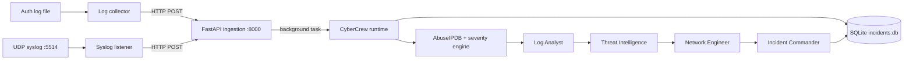

# CyberCrew

CyberCrew is an experimental AI-assisted SOC pipeline for analyzing SSH authentication logs. It combines deterministic parsing and severity scoring with a four-agent [CrewAI](https://www.crewai.com/) workflow, AbuseIPDB enrichment, mitigation recommendations, and a persistent SQLite incident timeline.

> [!IMPORTANT]
> CyberCrew is a proof of concept, not a production security control. It generates suggested firewall commands but does not execute them. Review all AI output and mitigation advice before acting on it.

## What it does

- Accepts individual authentication logs through a FastAPI endpoint.
- Receives UDP syslog messages and forwards them to the ingestion API.
- Tails a local log file while persisting its last-read offset.
- Extracts suspicious SSH activity and IP addresses.
- Enriches public IPs with AbuseIPDB reputation data.
- Scores incidents using deterministic log and threat-intelligence rules.
- Coordinates four specialist agents to analyze, enrich, mitigate, and report.
- Stores incidents and their event timelines in SQLite.
- Supports OpenAI-hosted models and local Ollama models through CrewAI.

## Architecture



The agents run sequentially:

1. **Log Analyst** parses SSH failures and extracts indicators.
2. **Threat Intelligence Specialist** enriches suspicious IP addresses.
3. **Network Automation Engineer** proposes firewall or monitoring actions.
4. **Incident Commander** produces a Markdown incident report.

## Project layout

```text
.
├── agents/                 CrewAI agent definitions and tools
├── collector/              File-tail collector and UDP syslog listener
├── incident_storage/       SQLAlchemy models and incident repository
├── ingestion/              FastAPI API, validation, and log storage helper
├── tools/                  Parsers, threat lookup, severity, and mitigations
├── cybercrew_runtime.py    Single-log analysis pipeline
├── main.py                 File-based pipeline entry point
├── Dockerfile              Container image for the file-based entry point
├── requirements.txt        Fully pinned dependency set
└── requirements.lock.txt   Alternate pinned environment snapshot
```

## Requirements

- Python 3.11 (the version used by the Docker image)
- An OpenAI API key, or a running Ollama server
- An AbuseIPDB API key for live IP reputation data (optional)

## Installation

```bash
git clone https://github.com/gitbenjazz/CyberCrew.git
cd CyberCrew
python3.11 -m venv .venv
source .venv/bin/activate
python -m pip install --upgrade pip
python -m pip install -r requirements.txt
```

Create a `.env` file in the repository root. For OpenAI:

```dotenv
LLM_PROVIDER=openai
CREWAI_MODEL=gpt-4o-mini
OPENAI_API_KEY=your_openai_api_key
ABUSEIPDB_API_KEY=your_abuseipdb_api_key
PIPELINE_TEMPERATURE=0.2
```

For Ollama:

```dotenv
LLM_PROVIDER=ollama
CREWAI_MODEL=llama3.2
ABUSEIPDB_API_KEY=your_abuseipdb_api_key
```

If `ABUSEIPDB_API_KEY` is omitted, threat lookups return an `unknown` reputation instead of failing the pipeline. Never commit `.env` or real API keys.

## Usage

### Analyze a log file

`main.py` expects `data/sample_logs/auth.log`. Create the file and add standard OpenSSH authentication entries, for example:

```text
Nov 22 10:15:31 server sshd[1234]: Failed password for admin from 203.0.113.10 port 52144 ssh2
```

Then run:

```bash
python main.py
```

The pipeline prints the final report and writes the incident timeline to `incident_storage/incidents.db`.

### Run the ingestion API

Start the API from the repository root:

```bash
uvicorn ingestion.server:app --host 0.0.0.0 --port 8000
```

Check its health:

```bash
curl http://127.0.0.1:8000/health
```

Submit a log:

```bash
curl -X POST http://127.0.0.1:8000/ingest/log \
  -H 'Content-Type: application/json' \
  -d '{"log":"Nov 22 10:15:31 server sshd[1234]: Failed password for admin from 203.0.113.10 port 52144 ssh2","source_ip":"127.0.0.1","transport":"manual"}'
```

The endpoint acknowledges the request immediately and runs the analysis as a FastAPI background task. Watch the server output for processing results.

### Receive UDP syslog

With the ingestion API running in one terminal, start the listener in another:

```bash
python -m collector.syslog_listener
```

Its defaults are configurable:

| Variable | Default | Purpose |
|---|---:|---|
| `SYSLOG_HOST` | `0.0.0.0` | Listener bind address |
| `SYSLOG_PORT` | `5514` | Non-privileged UDP port |
| `INGESTION_URL` | `http://127.0.0.1:8000/ingest/log` | Destination API |
| `SYSLOG_INGEST_TIMEOUT` | `3.0` | Forwarding timeout in seconds |

Send a local test message:

```bash
printf '%s' '<34>Nov 22 10:15:31 server sshd[1234]: Failed password for admin from 203.0.113.10 port 52144 ssh2' \
  | nc -u -w1 127.0.0.1 5514
```

### Tail a log file

`collector/run_collector.py` currently watches `test_auth.log` and records its byte offset in `collector/.authlog.offset`:

```bash
touch test_auth.log
python -m collector.run_collector
```

Append new SSH entries to the file while the collector is running. For another path or endpoint, instantiate `LogCollector` with different constructor arguments in your own launcher.

## Run with Docker

The image starts `main.py`, so mount or include the expected input file and provide model credentials at runtime:

```bash
docker build -t cybercrew .
docker run --rm \
  --env-file .env \
  -v "$PWD/data:/app/data:ro" \
  -v "$PWD/incident_storage:/app/incident_storage" \
  cybercrew
```

## Severity model

The rule engine adds points for known-risk IP reputation, hosting/data-center addresses, failed SSH authentication, invalid users, PAM failures, and failed `sudo` elevation. Scores map to the following levels:

| Score | Severity |
|---:|---|
| 70 or higher | Critical |
| 40–69 | High |
| 20–39 | Medium |
| Below 20 | Low |

The LLM explains and reports the incident, while the initial severity is calculated by code in `tools/severity_engine.py`.

## Current limitations

- The ingestion path creates a parent ingestion incident and `analyze_log()` creates a second analysis incident for the same log.
- Background work uses FastAPI in-process tasks; there is no durable queue, retry policy, authentication, or rate limiting.
- The UDP listener does not yet support TCP, TLS, or complete RFC 3164/5424 parsing.
- IP extraction and SSH parsing are intentionally simple and do not fully validate IPv4 addresses or support IPv6.
- The file collector does not currently handle log rotation and advances its offset after a partially failed batch.
- Incident reference IDs in the direct runtimes are timestamp-based to the second and may collide under concurrent execution.
- There is no automated test suite or CI workflow yet.

## Responsible use

CyberCrew sends log content to the configured LLM provider and public IPs to AbuseIPDB. Logs can contain usernames, hostnames, internal addresses, and other sensitive data. Review your retention, privacy, and provider policies before processing production telemetry. Prefer an approved local model when logs cannot leave your environment.

Generated `iptables` commands are recommendations only. Validate the address, rule order, persistence mechanism, and operational impact before applying any rule.

## Roadmap

Planned work includes stronger syslog normalization, TCP/TLS transport, additional collectors, durable event-driven processing, richer threat feeds, MITRE ATT&CK mapping, reporting, notifications, tests, and a dashboard. See [`To-Do-List`](To-Do-List) for the detailed project plan.

## Contributing

Issues and pull requests are welcome. Keep changes focused, avoid committing credentials or generated incident data, and add tests when introducing new parsing, scoring, or storage behavior.

## License

No license file is currently included. Unless a license is added, the repository remains **all rights reserved** by default.
